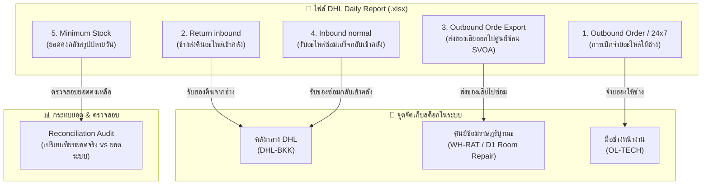

# คู่มือการจัดการข้อมูลและกลไกการเพิ่ม-ลดสต็อกของ DHL Daily Report
> **ATM Inventory System V2**  
> **เอกสารอ้างอิง:** กลไกการทำงานของระบบประมวลผลไฟล์ประจำวัน (`DailyReportController.cs`) และการกระทบยอดสต็อก

---

## 1. ภาพรวมการไหลเวียนข้อมูล (Data Flow Overview)

ในแต่ละวัน เมื่อมีการนำเข้า (Import) ไฟล์ **DHL Daily Report (Excel)** ระบบจะดึงข้อมูลจากแต่ละชีตมาวิเคราะห์ ตรวจสอบความถูกต้อง และปรับปรุงสถานะสต็อก/ซีเรียลนัมเบอร์ (S/N) อัตโนมัติ โดยแบ่งออกเป็น **5 ชีตสำคัญ**:

---

## 2. รายละเอียดการเพิ่ม-ลดสต็อกในแต่ละชีต (Sheet-by-Sheet)

### 🔵 ชีตที่ 1: `Outbound Order ` / `24x7 ACTIVITY` (การจ่ายของออก)
**วัตถุประสงค์:** บันทึกการจ่ายอะไหล่ออกจากคลังกลาง DHL ให้กับช่าง (Field Engineer - FE) เพื่อนำไปเปลี่ยนที่ตู้ ATM

| กรณีที่ตรวจพบ (Match Type) | เงื่อนไขการตรวจจับ | ผลต่อสต็อกคลังกลาง (`DHL-BKK`) | ผลต่อสต็อกช่าง (`OL-TECH`) | ผลต่อทะเบียน Serial Number (`PartUnits`) | เอกสาร / ใบเบิก |
|---|---|:---:|:---:|---|---|
| **OutboundConfirmed** (ตรงกับใบเบิกที่ขอไว้ในระบบ) | พบ `Case No` (ExternalTicketNo) หรือจับคู่ด้วยชื่อช่าง `FE Name` ตรงกับใบเบิกที่รออยู่ | **ลดลง (-Qty)** *(เฉพาะ Good)* | **เพิ่มขึ้น (+Qty)** *(Good)* | - เปลี่ยนสถานะ S/N เป็น `Issued` - ย้าย Location ไป `OL-TECH` | ปิดใบเบิกเป็น **"เบิก"** หรือ **"เดินทาง"** อัตโนมัติ |
| **OutboundAutoTicket** (ช่างเบิกตรงที่คลัง DHL ไม่มีในระบบล่วงหน้า) | ไม่พบใบเบิกในระบบ แต่รหัสอะไหล่ถูกต้อง | **ลดลง (-Qty)** *(เฉพาะ Good)* | **เพิ่มขึ้น (+Qty)** *(Good)* | - ลงทะเบียน S/N ใหม่ (ถ้ามี) - ตั้งสถานะเป็น `Issued` ที่ `OL-TECH` | **สร้าง Ticket และใบเบิก (WD-xxxx) ให้อัตโนมัติ** พร้อมผูกชื่อช่างจากคอลัมน์ FE Name |
| **AlreadyImported** (รายการนี้เคยถูกนำเข้าแล้ว) | S/N หรือ Case No + PartNo นี้ถูกจ่ายออกไปแล้ว | **ไม่เปลี่ยนแปลง (0)** | **ไม่เปลี่ยนแปลง (0)** | ไม่เปลี่ยนแปลง | ข้ามรายการ เพื่อไม่ให้ตัดสต็อกซ้ำ |
| **PriorToBaseline** (เกิดขึ้นก่อน 3 ก.ย. 2026) | เป็นการเบิกจ่ายก่อนวันตั้งต้นระบบ | **ไม่ลดคลังกลาง (0)** *(เพราะยอดยกมาหักไปแล้ว)* | **เพิ่มขึ้น (+Qty)** *(Good)* | ลงทะเบียน S/N ให้ช่างถืออยู่ (`Issued`) | สร้างประวัติใบเบิกย้อนหลังให้อัตโนมัติ |

---

### 🟢 ชีตที่ 2: `Return inbound` (การรับของคืนจากช่าง)
**วัตถุประสงค์:** บันทึกเมื่อช่างส่งชิ้นส่วนกลับเข้าคลัง DHL (อาจเป็นอะไหล่ดีที่ไม่ได้ใช้ หรืออะไหล่เสียที่ถอดเปลี่ยนจากหน้าตู้)

| กรณีที่ตรวจพบ (Match Type) | เงื่อนไขการตรวจจับ | ผลต่อสต็อกคลังกลาง (`DHL-BKK`) | ผลต่อสต็อกช่าง (`OL-TECH`) | ผลต่อทะเบียน Serial Number (`PartUnits`) | เอกสาร / ใบเบิก |
|---|---|:---:|:---:|---|---|
| **ReturnConfirmed (ของดี)** ช่างคืนอะไหล่ดี (`Status = GOOD`) | ตรงกับรายการรอคืนในระบบ หรือพบ Case No | **สต็อกดีเพิ่ม (+Qty)** | **สต็อกดีลด (-Qty)** | - สถานะเปลี่ยนเป็น `InStock` - ย้ายกลับคลัง `DHL-BKK` - Condition = `Good` | ปิดสถานะการคืนเป็น **"คืน"** สมบูรณ์ |
| **ReturnConfirmed (ของเสีย)** ช่างคืนอะไหล่เสีย (`Status = BAD`) | ถอดอะไหล่เสียกลับมาส่งคลัง | **สต็อกซ่อมเพิ่ม (+Qty)** *(RepairQty)* | **สต็อกดีลด (-Qty)** *(ตัดออกจากมือช่าง)* | - สถานะเปลี่ยนเป็น `InRepair` - ย้ายเข้าคลัง `DHL-BKK` - Condition = `Bad` | ปิดสถานะการคืนเป็น **"คืน"** สมบูรณ์ |
| **Unmatched Return** (ส่งคืนนอกระบบ / ไม่มีใบงานเดิม) | คืนอะไหล่แต่หาเลข Case No หรือใบเบิกเดิมไม่พบ | **สต็อกเพิ่ม (+Qty)** *(Good หรือ Repair ตามสภาพ)* | **ไม่เปลี่ยนแปลง (0)** | - ลงทะเบียน S/N เข้าคลัง - สถานะ `InStock` หรือ `InRepair` | บันทึกประวัติรับคืนแบบไม่มีใบงาน |
| **PriorToBaseline** (คืนก่อน 3 ก.ย. 2026) | เกิดขึ้นก่อนวันตั้งต้นระบบ | **ไม่เปลี่ยนแปลง (0)** | **ไม่เปลี่ยนแปลง (0)** | ลงทะเบียนชื่อ S/N เข้าประวัติระบบ (ไม่บวมสต็อก) | บันทึกเฉพาะทะเบียน |

---

### 🟠 ชีตที่ 3: `Outbound Orde Export` (ส่งของเสียออกไปศูนย์ซ่อม SVOA ราษฎร์บูรณะ)
**วัตถุประสงค์:** บันทึกการส่งอะไหล่เสียออกจากคลังกลาง DHL ไปยังห้องแล็บซ่อม DataOne (`Customer site = D1 Room Repair`, `Address = SVOA ราษฎร์บูรณะ เลขที่ 131...`)

| กรณีที่ตรวจพบ (Match Type) | เงื่อนไขการตรวจจับ | ผลต่อสต็อกคลังกลาง (`DHL-BKK`) | ผลต่อสต็อกศูนย์ซ่อม (`WH-RAT`) | ผลต่อทะเบียน Serial Number (`PartUnits`) |
|---|---|:---:|:---:|---|
| **ExportRepair** (ส่งออกไปศูนย์ซ่อมสำเร็จ) | ตรวจพบในชีต `Outbound Orde Export` รายการหลังวันตั้งต้น | **สต็อกซ่อมลดลง (-Qty)** *(ตัดออกจากคลัง DHL)* | **สต็อกซ่อมเพิ่มขึ้น (+Qty)** *(เข้าคลังราษฎร์บูรณะ)* | - สถานะคงเป็น `InRepair` - **ย้าย LocationId ไป `WH-RAT`** (แสดงผล: `🔧 Ratchaburana (D1 Room Repair)`) |
| **AlreadyImported** (เคยส่งออกไปแล้ว) | S/N นี้อยู่ในตำแหน่ง `WH-RAT` เรียบร้อยแล้ว | **ไม่เปลี่ยนแปลง (0)** | **ไม่เปลี่ยนแปลง (0)** | ไม่เปลี่ยนแปลง |
| **PriorToBaseline** (ส่งออกก่อน 3 ก.ย. 2026) | เกิดขึ้นก่อนวันตั้งต้น | **ไม่เปลี่ยนแปลง (0)** | **ไม่เปลี่ยนแปลง (0)** | บันทึกตำแหน่ง S/N ให้อยู่ที่ `WH-RAT` โดยไม่ปรับสต็อกซ้ำ |

---

### 🟣 ชีตที่ 4: `Inbound normal` (รับของซ่อมเสร็จจาก SVOA / ศูนย์ซ่อม)
**วัตถุประสงค์:** รับอะไหล่ที่ซ่อมเสร็จจาก `D1 Room Repair` (SVOA ราษฎร์บูรณะ) กลับเข้าสต็อกของดีพร้อมใช้งานที่คลัง DHL

| กรณีที่ตรวจพบ (Match Type) | เงื่อนไขการตรวจจับ | สต็อกรอซ่อม (`RepairQty`) | สต็อกของดี (`GoodQty`) | ผลต่อทะเบียน Serial Number (`PartUnits`) |
|---|---|:---:|:---:|---|
| **InboundRepaired** (รับของซ่อมเสร็จ) | ตรวจพบรายการในชีต `Inbound normal` หลังวันตั้งต้น | **ลดลง (-Qty)** *(ตัดออกจาก WH-RAT ก่อน หากไม่พอลดจาก DHL-BKK)* | **เพิ่มขึ้น (+Qty)** *(เข้าคลังของดี DHL-BKK)* | - ปรับสถานะเป็น `InStock` - สภาพเป็น `Good` - **ย้าย LocationId กลับมาที่ `DHL-BKK`** |
| **AlreadyImported** (เคยรับเข้าแล้ว) | S/N นี้อยู่ในสถานะ `InStock` ที่คลัง `DHL-BKK` เรียบร้อยแล้ว | **ไม่เปลี่ยนแปลง (0)** | **ไม่เปลี่ยนแปลง (0)** | ไม่เปลี่ยนแปลง |
| **PriorToBaseline** (รับเข้าก่อน 3 ก.ย. 2026) | เกิดขึ้นก่อนวันตั้งต้นระบบ | **ไม่เปลี่ยนแปลง (0)** | **ไม่เปลี่ยนแปลง (0)** | ปรับสถานะ S/N ให้อยู่ที่ `DHL-BKK` โดยไม่กระทบยอดสต็อก |

---

### 🟡 ชีตที่ 5: `Minimum Stock` (ยอดคงคลังสรุป ณ สิ้นวัน)
**วัตถุประสงค์:** ตรวจสอบและกระทบยอด (Reconciliation) สต็อกทั้งหมดในคลัง DHL-BKK

* **ชีตนี้ไม่ปรับปรุงสต็อกโดยตรง** (เพื่อป้องกันการเขียนทับธุรกรรมระหว่างวัน)
* ระบบจะนำค่า `AVAILABLE_QTY` ของ DHL มาเปรียบเทียบกับ `PartStocks` ของระบบ:
  $$\text{ส่วนต่าง (Diff)} = \text{ยอดในระบบ (System Qty)} - \text{ยอดคลัง DHL (DHL Available Qty)}$$
* **ผลลัพธ์:**
  * หากส่วนต่างเป็น **`0`**: สถานะ **"ตรงกันสมบูรณ์ (Matched)"**
  * หากส่วนต่าง **$\neq 0$**: ขึ้นแถบเตือนสีส้ม/แดง **"ยอดไม่ตรง (Discrepancy)"** พร้อมระบุจำนวนที่คลาดเคลื่อนให้ผู้ดูแลระบบตรวจสอบทันที

---

## 3. สรุปตารางผลกระทบสต็อกภาพรวม (Master Impact Matrix)

| แหล่งที่มา / ชีต | ประเภทรายการ | สต็อก DHL-BKK (ดี) | สต็อก DHL-BKK (ซ่อม) | สต็อกศูนย์ซ่อม WH-RAT (ซ่อม) | สต็อกช่าง OL-TECH | S/N Status & ตำแหน่ง |
|---|---|:---:|:---:|:---:|:---:|---|
| **Outbound Order** | จ่ายของให้ช่าง | **- Qty** | 0 | 0 | **+ Qty** | `Issued` (ถือครองโดยช่าง) |
| **Return inbound** | ช่างคืนของดี | **+ Qty** | 0 | 0 | **- Qty** | `InStock` (คลัง DHL-BKK) |
| **Return inbound** | ช่างคืนของเสีย | 0 | **+ Qty** | 0 | **- Qty** | `InRepair` (พักรอซ่อมที่ DHL-BKK) |
| **Outbound Orde Export** | ส่งของเสียไปศูนย์ซ่อม | 0 | **- Qty** | **+ Qty** | 0 | `InRepair` (ย้ายไป `WH-RAT`) |
| **Inbound normal** | ซ่อมเสร็จกลับเข้าคลัง | **+ Qty** | 0 | **- Qty** | 0 | `InStock` (ย้ายกลับ `DHL-BKK`) |
| **Undo แถว Import** | ยกเลิกรายการที่ Import ผิด | คืนทิศตรงข้าม 100% | คืนทิศตรงข้าม 100% | คืนทิศตรงข้าม 100% | คืนทิศตรงข้าม 100% | คืนสถานะและตำแหน่งเดิม |

---

## 4. ระบบป้องกันข้อผิดพลาดและความปลอดภัย (Safety Features)

1. **Pre-Import Confirmation Modal (กล่องยืนยันก่อนบันทึก):**
   - แสดงตัวอย่างการคำนวณล่วงหน้า (Preview) แยกตามชีต
   - แสดงจำนวนแถวที่จะตัดสต็อก, จำนวนที่จะสร้าง Ticket อัตโนมัติ และจำนวนแถวที่เกิดก่อนวันตั้งต้น
   - ผู้ใช้ต้องกดยืนยันก่อน ระบบจึงจะทำการบันทึกจริง (`Commit = true`)
2. **Double-Deduction Prevention (ป้องกันการตัดสต็อกซ้ำ):**
   - มีระบบจดจำ S/N และ Transaction Key รายแถว
   - อะไหล่ที่ถูกจ่ายออกหรือคืนไปแล้ว หากนำเข้าไฟล์เดิมซ้ำ ระบบจะปรับเป็น `AlreadyImported` โดยไม่แตะต้องยอดสต็อก
3. **Selective Row Undo (ระบบย้อนกลับรายแถว):**
   - หากตรวจพบว่าแถวใดแถวหนึ่งผิดพลาด Admin สามารถกดปุ่ม **"ย้อนกลับ (Undo)"** เฉพาะแถวนั้นได้
   - ระบบจะคืนสต็อกและปรับสถานะ S/N ให้กลับไปเป็นสภาพก่อนนำเข้าอัตโนมัติ
4. **Local Context Stock Guard (ป้องกันสต็อกติดลบ):**
   - ในการวนลูปแถวข้อมูลจำนวนมาก ระบบตรวจสอบทั้ง `PartStocks.Local` และ Database ร่วมกับ `Math.Min` เพื่อป้องกันการเกิด Concurrency หรือข้อผิดพลาด Insufficient Stock

---

## 5. การจับคู่สถานที่จริงระหว่าง Excel และระบบ (Location Mapping Master)

จากการวิเคราะห์ไฟล์ Excel Daily Report ของ DHL ทุกชีตและสแกนชุดข้อมูลจริง (ไฟล์ 03 Sep, 04-05 Sep, 07 Sep) พบความเชื่อมโยงกับฐานข้อมูลของระบบ ดังนี้:

| รหัสในระบบ (Code) | ชื่อสถานที่ในระบบ | คอลัมน์ / ข้อความที่ปรากฏใน Excel Daily Report | ประเภท / บทบาท | ไอคอนประจำสถานที่ | หมายเหตุ / ข้อมูลที่พบใน Excel จริง |
|---|---|---|---|:---:|---|
| **`DHL-BKK`** | DHL Supply Chain (DataOne BDC) | `WAREHOUSE = BDC_DATA_ONE` `LOCATION / Bin Location` เช่น `PR0000`, `AA001A`, `AA002A` (รวม 18 Bins) | คลังสินค้าหลัก (Main Warehouse) | `mdi:warehouse` *(สีเขียว emerald)* | เป็นคลังเก็บอะไหล่หลักของโครงการ ทั้งของดีพร้อมจ่ายและของเสียรอส่งซ่อม |
| **`WH-RAT`** | คลังราษฎร์บูรณะ (ศูนย์ซ่อมแล็บ) | `Customer site = D1 Room Repair` `Address = SVOA ราษฎร์บูรณะ เลขที่ 131...` `Shipped from = D1 Room Repair` | ศูนย์ซ่อม / Lab ซ่อมบอร์ด | `mdi:home-repair-service` *(สีส้มเข้ม amber)* | **สถานที่เดียวกันกับที่ระบุใน Excel** รองรับการส่งบอร์ด/โมดูลไปซ่อมที่ SVOA |
| **`OL-TECH`** | ช่างหน้างาน (Field Engineers) | `FE Name` / `Technician Name` (ในชีต Outbound Order และ Return Inbound) | ผู้ถือครองอะไหล่หน้างาน | `mdi:account-wrench` *(สีน้ำเงิน primary)* | ระบุตัวตนตามชื่อช่างแต่ละคน เช่น ชิษณุพงศ์, ทัศนัย, ชลิต ฯลฯ |
| **`GRG-BKK`** | ศูนย์ GRG ประจำประเทศไทย | *(ไม่ปรากฏใน Excel รายวัน)* | ผู้ผลิต/คลังต้นทางต่างประเทศ | `mdi:cog-box` *(สีฟ้าคราม cyan)* | รองรับการรับอะไหล่ใหม่จากผู้ผลิต GRG โดยตรง |
| **`APT-BKK`** | ศูนย์สุวรรณภูมิ / คลังด่วน Airport | *(ไม่ปรากฏใน Excel รายวัน)* | คลังสำรองเร่งด่วน | `mdi:airplane-takeoff` *(สีฟ้า sky)* | คลังสำรองสำหรับอะไหล่นำเข้าเร่งด่วน |
| **`SCRAP-01`** | โกดังแทงจำหน่าย (Scrap Warehouse) | *(ไม่ปรากฏใน Excel รายวัน)* | คลังซาก / ตัดจำหน่าย | `mdi:delete-sweep` *(สีเทา slate)* | รองรับอะไหล่ที่ไม่สามารถซ่อมได้ (`IsUnrepairable = true`) |
| **`TRANSIT-01`** | อยู่ระหว่างจัดส่ง (In Transit) | *(ไม่ปรากฏใน Excel รายวัน)* | สถานะระหว่างขนส่ง | `mdi:truck-fast-outline` *(สีส้ม amber)* | ใช้รองรับการย้ายระหว่างสาขา/ขนส่งภายนอก |
