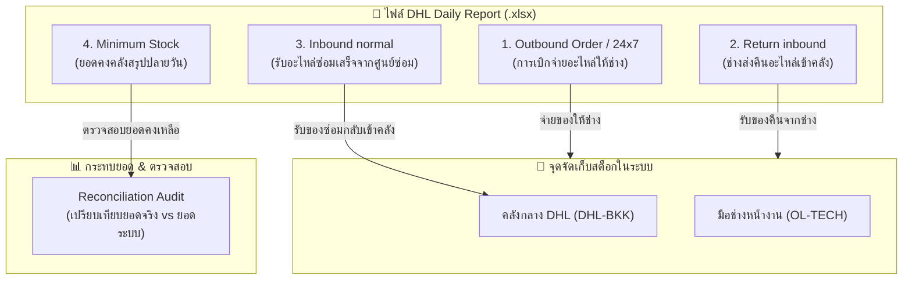

# คู่มือการจัดการข้อมูลและกลไกการเพิ่ม-ลดสต็อกของ DHL Daily Report
> **ATM Inventory System V2**  
> **เอกสารอ้างอิง:** กลไกการทำงานของระบบประมวลผลไฟล์ประจำวัน (`DailyReportController.cs`) และการกระทบยอดสต็อก

---

## 1. ภาพรวมการไหลเวียนข้อมูล (Data Flow Overview)

ในแต่ละวัน เมื่อมีการนำเข้า (Import) ไฟล์ **DHL Daily Report (Excel)** ระบบจะดึงข้อมูลจากแต่ละชีตมาวิเคราะห์ ตรวจสอบความถูกต้อง และปรับปรุงสถานะสต็อก/ซีเรียลนัมเบอร์ (S/N) อัตโนมัติ โดยแบ่งออกเป็น **4 ชีตหลัก**:

---

## 2. รายละเอียดการเพิ่ม-ลดสต็อกในแต่ละชีต (Sheet-by-Sheet)

### 🔵 ชีตที่ 1: `Outbound Order ` / `24x7 ACTIVITY` (การจ่ายของออก)
**วัตถุประสงค์:** บันทึกการจ่ายอะไหล่ออกจากคลังกลาง DHL ให้กับช่าง (Field Engineer - FE) เพื่อนำไปเปลี่ยนที่ตู้ ATM

| กรณีที่ตรวจพบ (Match Type) | เงื่อนไขการตรวจจับ | ผลต่อสต็อกคลังกลาง (`DHL-BKK`) | ผลต่อสต็อกช่าง (`OL-TECH`) | ผลต่อทะเบียน Serial Number (`PartUnits`) | เอกสาร / ใบเบิก |
|---|---|:---:|:---:|---|---|
| **OutboundConfirmed** (ตรงกับใบเบิกที่ขอไว้ในระบบ) | พบ `Case No` (ExternalTicketNo) หรือจับคู่ด้วยชื่อช่าง `FE Name` ตรงกับใบเบิกที่รออยู่ | **ลดลง (-Qty)** *(เฉพาะ Good)* | **เพิ่มขึ้น (+Qty)** *(Good)* | - เปลี่ยนสถานะ S/N เป็น `Issued` - ย้าย Location ไป `OL-TECH` | ปิดใบเบิกเป็น **"เบิก"** หรือ **"เดินทาง"** อัตโนมัติ |
| **OutboundAutoTicket** (ช่างเบิกตรงที่คลัง DHL ไม่มีในระบบล่วงหน้า) | ไม่พบใบเบิกในระบบ แต่รหัสอะไหล่ถูกต้อง | **ลดลง (-Qty)** *(เฉพาะ Good)* | **เพิ่มขึ้น (+Qty)** *(Good)* | - ลงทะเบียน S/N ใหม่ (ถ้ามี) - ตั้งสถานะเป็น `Issued` ที่ `OL-TECH` | **สร้าง Ticket และใบเบิก (WD-xxxx) ให้อัตโนมัติ** พร้อมผูกชื่อช่างจากคอลัมน์ FE Name |
| **AlreadyImported** (รายการนี้เคยถูกนำเข้าแล้ว) | S/N หรือ Case No + PartNo นี้ถูกจ่ายออกไปแล้ว | **ไม่เปลี่ยนแปลง (0)** | **ไม่เปลี่ยนแปลง (0)** | ไม่เปลี่ยนแปลง | ข้ามรายการ เพื่อไม่ให้ตัดสต็อกซ้ำ |
| **PriorToBaseline** (เกิดขึ้นก่อน 3 ก.ย. 2026) | เป็นการเบิกจ่ายก่อนวันตั้งต้นระบบ | **ไม่ลดคลังกลาง (0)** *(เพราะยอดยกมาหักไปแล้ว)* | **เพิ่มขึ้น (+Qty)** *(Good)* | ลงทะเบียน S/N ให้ช่างถืออยู่ (`Issued`) | สร้างประวัติใบเบิกย้อนหลังให้อัตโนมัติ |

---

### 🟢 ชีตที่ 2: `Return inbound` (การรับของคืนจากช่าง)
**วัตถุประสงค์:** บันทึกเมื่อช่างส่งชิ้นส่วนกลับเข้าคลัง DHL (อาจเป็นอะไหล่ดีที่ไม่ได้ใช้ หรืออะไหล่เสียที่ถอดเปลี่ยนจากหน้าตู้)

| กรณีที่ตรวจพบ (Match Type) | เงื่อนไขการตรวจจับ | ผลต่อสต็อกคลังกลาง (`DHL-BKK`) | ผลต่อสต็อกช่าง (`OL-TECH`) | ผลต่อทะเบียน Serial Number (`PartUnits`) | เอกสาร / ใบเบิก |
|---|---|:---:|:---:|---|---|
| **ReturnConfirmed (ของดี)** ช่างคืนอะไหล่ดี (`Status = GOOD`) | ตรงกับรายการรอคืนในระบบ หรือพบ Case No | **สต็อกดีเพิ่ม (+Qty)** | **สต็อกดีลด (-Qty)** | - สถานะเปลี่ยนเป็น `InStock` - ย้ายกลับคลัง `DHL-BKK` - Condition = `Good` | ปิดสถานะการคืนเป็น **"คืน"** สมบูรณ์ |
| **ReturnConfirmed (ของเสีย)** ช่างคืนอะไหล่เสีย (`Status = BAD`) | ถอดอะไหล่เสียกลับมาส่งคลัง | **สต็อกซ่อมเพิ่ม (+Qty)** *(RepairQty)* | **สต็อกดีลด (-Qty)** *(ตัดออกจากมือช่าง)* | - สถานะเปลี่ยนเป็น `InRepair` - ย้ายเข้าคลัง `DHL-BKK` - Condition = `Bad` | ปิดสถานะการคืนเป็น **"คืน"** สมบูรณ์ |
| **Unmatched Return** (ส่งคืนนอกระบบ / ไม่มีใบงานเดิม) | คืนอะไหล่แต่หาเลข Case No หรือใบเบิกเดิมไม่พบ | **สต็อกเพิ่ม (+Qty)** *(Good หรือ Repair ตามสภาพ)* | **ไม่เปลี่ยนแปลง (0)** | - ลงทะเบียน S/N เข้าคลัง - สถานะ `InStock` หรือ `InRepair` | บันทึกประวัติรับคืนแบบไม่มีใบงาน |
| **PriorToBaseline** (คืนก่อน 3 ก.ย. 2026) | เกิดขึ้นก่อนวันตั้งต้นระบบ | **ไม่เปลี่ยนแปลง (0)** | **ไม่เปลี่ยนแปลง (0)** | ลงทะเบียนชื่อ S/N เข้าประวัติระบบ (ไม่บวมสต็อก) | บันทึกเฉพาะทะเบียน |

---

### 🟣 ชีตที่ 3: `Inbound normal` (รับของซ่อมเสร็จจาก SVOA / ศูนย์ซ่อม)
**วัตถุประสงค์:** รับอะไหล่ที่ส่งไปซ่อมกลับมาเข้าสต็อกของดีพร้อมใช้งาน

| กรณีที่ตรวจพบ (Match Type) | เงื่อนไขการตรวจจับ | สต็อกรอซ่อม (`RepairQty`) | สต็อกของดี (`GoodQty`) | ผลต่อทะเบียน Serial Number (`PartUnits`) |
|---|---|:---:|:---:|---|
| **RepairCompleted** (อะไหล่ที่ส่งซ่อม ซ่อมเสร็จแล้ว) | S/N เดิมอยู่ในระบบและมีสถานะ `InRepair` | **ลดลง (-Qty)** *(ตัดสต็อกรอซ่อมออก)* | **เพิ่มขึ้น (+Qty)** *(เพิ่มเข้าสต็อกของดี)* | - เปลี่ยนสถานะจาก `InRepair` $\rightarrow$ `InStock` - เปลี่ยน Condition เป็น `Good` |
| **InboundRepaired** (รับเข้าของซ่อมเสร็จทั่วไป/ชิ้นส่วนทั่วไป) | S/N ไม่อยู่ในสถานะซ่อม หรือเป็นชิ้นส่วนทั่วไปที่ไม่มี S/N | ไม่เปลี่ยนแปลง (0) | **เพิ่มขึ้น (+Qty)** *(Good)* | ลงทะเบียน S/N ใหม่ (ถ้ามี) เข้าสถานะ `InStock` |

---

### 🟡 ชีตที่ 4: `Minimum Stock` (ยอดคงคลังสรุป ณ สิ้นวัน)
**วัตถุประสงค์:** ตรวจสอบและกระทบยอด (Reconciliation) สต็อกทั้งหมดในคลัง DHL-BKK

* **ชีตนี้ไม่ปรับปรุงสต็อกโดยตรง** (เพื่อป้องกันการเขียนทับธุรกรรมระหว่างวัน)
* ระบบจะนำค่า `AVAILABLE_QTY` ของ DHL มาเปรียบเทียบกับ `PartStocks` ของระบบ:
  $$\text{ส่วนต่าง (Diff)} = \text{ยอดในระบบ (System Qty)} - \text{ยอดคลัง DHL (DHL Available Qty)}$$
* **ผลลัพธ์:**
  * หากส่วนต่างเป็น **`0`**: สถานะ **"ตรงกันสมบูรณ์ (Matched)"**
  * หากส่วนต่าง **$\neq 0$**: ขึ้นแถบเตือนสีส้ม/แดง **"ยอดไม่ตรง (Discrepancy)"** พร้อมระบุจำนวนที่คลาดเคลื่อนให้ผู้ดูแลระบบตรวจสอบทันที

---

## 3. สรุปตารางผลกระทบสต็อกภาพรวม (Master Impact Matrix)

| แหล่งที่มา / ชีต | ประเภทรายการ | สต็อก DHL-BKK (ดี) | สต็อก DHL-BKK (ซ่อม) | สต็อกช่าง OL-TECH | S/N Status |
|---|---|:---:|:---:|:---:|---|
| **Outbound Order** | จ่ายของให้ช่าง | **- Qty** | 0 | **+ Qty** | `Issued` |
| **Return inbound** | ช่างคืนของดี | **+ Qty** | 0 | **- Qty** | `InStock` |
| **Return inbound** | ช่างคืนของเสีย | 0 | **+ Qty** | **- Qty** | `InRepair` |
| **Inbound normal** | ซ่อมเสร็จกลับเข้าคลัง | **+ Qty** | **- Qty** | 0 | `InRepair` $\rightarrow$ `InStock` |
| **Undo แถว Import** | ยกเลิกรายการที่ Import ผิด | ย้อนกลับทิศทางตรงกันข้ามกับ Action เดิม 100% | ย้อนกลับทิศทางตรงกันข้ามกับ Action เดิม 100% | ย้อนกลับทิศทางตรงกันข้ามกับ Action เดิม 100% | คืนสถานะเดิม |

---

## 4. ระบบป้องกันข้อผิดพลาดและความปลอดภัย (Safety Features)

1. **Pre-Import Confirmation Modal (กล่องยืนยันก่อนบันทึก):**
   - แสดงตัวอย่างการคำนวณล่วงหน้า (Preview) แยกตามชีต
   - แสดงจำนวนแถวที่จะตัดสต็อก, จำนวนที่จะสร้าง Ticket อัตโนมัติ และจำนวนแถวที่เกิดก่อนวันตั้งต้น
   - ผู้ใช้ต้องกดยืนยันก่อน ระบบจึงจะทำการบันทึกจริง (`Commit = true`)
2. **Double-Deduction Prevention (ป้องกันการตัดสต็อกซ้ำ):**
   - มีระบบจดจำ S/N และ Transaction Key รายแถว
   - อะไหล่ที่ถูกจ่ายออกหรือคืนไปแล้ว หากนำเข้าไฟล์เดิมซ้ำ ระบบจะปรับเป็น `AlreadyImported` โดยไม่แตะต้องยอดสต็อก
3. **Selective Row Undo (ระบบย้อนกลับรายแถว):**
   - หากตรวจพบว่าแถวใดแถวหนึ่งผิดพลาด Admin สามารถกดปุ่ม **"ย้อนกลับ (Undo)"** เฉพาะแถวนั้นได้
   - ระบบจะคืนสต็อกและปรับสถานะ S/N ให้กลับไปเป็นสภาพก่อนนำเข้าอัตโนมัติ
