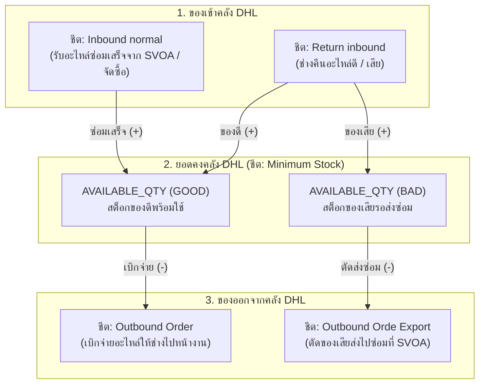
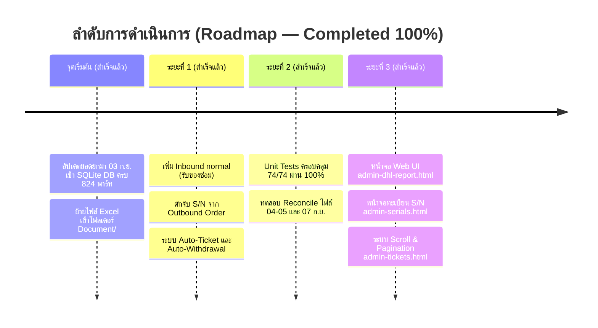

# แผนการเชื่อมโยงและปรับปรุงระบบคลังสินค้ากับรายงานประจำวัน DHL (DHL Daily Report Integration Plan)

> **เอกสารสรุปผลการวิเคราะห์และแผนการพัฒนาระบบ**  
> **โครงการ:** ATM Inventory System V2  
> **วันที่จัดทำ:** 8 กันยายน 2026  
> **ไฟล์อ้างอิง:** `Dataone Daily Report 03 Sep`, `04-05 Sep`, `07 Sep 2026_.xlsx` ในโฟลเดอร์ `Document/`

---

## 1. บทสรุปผู้บริหาร (Executive Summary)

จากการวิเคราะห์ไฟล์ **DHL Daily Report** เชิงลึก และตรวจกระทบยอด (Reconciliation) ระหว่างวันที่ 3 ก.ย., 4-5 ก.ย. และ 7 ก.ย. 2026 พบข้อเท็จจริงสำคัญดังนี้:

1. **ชีต `Minimum Stock` คือ Snapshot ยอดคงคลังปลายวัน:**
   * ตัวเลขสอดคล้องกับการเคลื่อนไหวในชีตธุรกรรม **100%**
   * คอลัมน์ `STOCK` ไม่ใช่สต็อกคงเหลือ แต่เป็นค่าส่วนต่างเกณฑ์ขั้นต่ำ (`STOCK = AVAILABLE_QTY - MIN QTY`)
   * พาร์ทเดียวกันอาจมีหลายแถวแยกตามสถานะ (`GOOD` และ `BAD`)
2. **ชีต `ReturnWH` ไม่สามารถใช้เทียบสต็อกอะไหล่ได้:**
   * เป็นเพียงใบบันทึกการรับมอบกล่องพัสดุจากคนขับรถ (ไม่มีรหัสอะไหล่ / ไม่มี S/N)
   * ข้อมูลอะไหล่รายชิ้นที่แท้จริงจะถูกบันทึกในชีต `Return inbound` หลังจากเจ้าหน้าที่เปิดกล่องตรวจนับแล้ว
3. **การตั้งต้นฐานข้อมูล (Baseline 03 ก.ย. 2026) สำเร็จเรียบร้อยแล้ว:**
   * ฐานข้อมูล SQLite ในเครื่อง (`Backend/Api/AtmInventory.db`) ได้รับการอัปเดตยอดยกมาตามคลัง DHL ครบถ้วน **100% (824 พาร์ท, Good = 19,060 ชิ้น, Repair = 862 ชิ้น)**
   * รัน Unit Tests ผ่านครบ 74/74 Tests (100% Passing)
4. **ไฟล์ Excel ถูกย้ายไปที่โฟลเดอร์โครงการแล้ว:**
   * อยู่ที่ `E:\Playground\ATM-Inventory-System_V2\Document\`

---

## 2. โครงสร้างความสัมพันธ์ของชีตใน Excel (Data Flow Model)

ระบบของ DHL มีวงจรการไหลของอะไหล่ที่ชัดเจนและสมบูรณ์แบบดังนี้:



---

## 3. สภาพปัญหาของระบบปัจจุบัน (Current Limitations)

| จุดที่พบปัญหา | ระบบปัจจุบัน | พฤติกรรมจริงในไฟล์ Excel | ผลกระทบ |
| :--- | :--- | :--- | :--- |
| **1. การรับของซ่อมเสร็จ** | รออ่าน S/N ที่ซ่อมเสร็จจาก `Return inbound` | ของซ่อมเสร็จบันทึกอยู่ใน **`Inbound normal`** (`Shipped from: D1 Room Repair`) | อะไหล่ที่ซ่อมเสร็จค้างสถานะ `InRepair` ไม่ยอมเปลี่ยนเป็นพร้อมใช้ |
| **2. การเบิกจ่ายอะไหล่** | ยังไม่มีการอ่านชีต `Outbound Order ` | DHL บันทึกการจ่ายของให้ช่างและ S/N ไว้ใน **`Outbound Order `** | ไม่ได้ S/N ตั้งแต่ตอนเริ่มส่งมอบ ต้องรอจนกว่าช่างจะส่งคืน |
| **3. การตรวจกระทบยอด** | ยังไม่มีระบบ Reconcile สิ้นวัน | มีชีต `Minimum Stock` สำหรับตรวจยอดคงเหลือ | เสี่ยงสต็อกสะสมคลาดเคลื่อนโดยไม่รู้ตัว |

---

## 4. แผนการปรับปรุงระบบ (Action Plan & Implementation)

### 📌 ขั้นตอนที่ 1: ปรับปรุง Backend (`DailyReportController.cs`)
ขยายความสามารถในการอ่านไฟล์ Daily Report ให้ครอบคลุมทุกมิติ:

```csharp
// สถาปัตยกรรมการประมวลผลไฟล์ประจำวันแบบ 4 ขั้นตอน:
public class DailyReportProcessor 
{
    // 1. ประมวลผลการเบิกจ่าย (Outbound Order)
    ProcessOutboundOrders(wb.Worksheet("Outbound Order "));
    
    // 2. ประมวลผลการส่งคืนของช่าง (Return inbound) - มีอยู่แล้ว
    ProcessReturns(wb.Worksheet("Return inbound"));
    
    // 3. ประมวลผลการรับของซ่อมเสร็จ (Inbound normal) - เพิ่มใหม่
    ProcessRepairedInbound(wb.Worksheet("Inbound normal"));
    
    // 4. กระทบยอดสต็อกปลายวัน (Minimum Stock Audit) - เพิ่มใหม่
    AuditMinimumStock(wb.Worksheet("Minimum Stock"));
}
```

1. **รองรับชีต `Inbound normal`:**
   * กรองแถวที่ `Shipped from` มีคำว่า `Repair` หรือ `SVOA` และสถานะเป็น `GOOD`
   * ค้นหา `PartUnits` ตาม `SerialNo` $\rightarrow$ เปลี่ยนสถานะจาก `InRepair` เป็น `InStock` (Condition = `Good`)
   * โยกสต็อกใน `PartStocks`: ลด `RepairQty -1` และเพิ่ม `GoodQty +1`
2. **รองรับชีต `Outbound Order `:**
   * จับคู่ด้วย `Case No` กับใบเบิกในระบบ (`ExternalTicketNo`)
   * เมื่อ DHL สแกนจ่าย $\rightarrow$ ตัดสต็อกคลัง `DHL-BKK (-1)` โยกไปที่มือช่าง `OL-TECH (+1)`
   * **Auto-Register S/N:** บันทึก `SERIAL_NUMBER` ลง `PartUnits` (สถานะ `Issued`, Location = `OL-TECH`) ทันที
3. **รองรับการตรวจกระทบยอดชีต `Minimum Stock`:**
   * นำยอด `AVAILABLE_QTY` (Good/Bad) มาเปรียบเทียบกับ `PartStocks` ที่ Location `DHL-BKK`
   * หากผลต่าง $\neq 0$ ให้สร้าง Flag แจ้งเตือน Discrepancy พร้อมรายละเอียด

---

### 📌 ขั้นตอนที่ 2: กลยุทธ์การจัดการ Serial Number (Organic Registration)
* **ไม่ต้องบังคับให้มี S/N ครบ 19,000 ตัวตั้งแต่วันแรก** (เนื่องจากคลัง 3PL ไม่สามารถทำ On-hand Serial Report ให้ได้)
* **ใช้ระบบสะสม S/N อัตโนมัติตามการใช้งาน (Transaction-Driven):**
  * S/N จะถูกดักจับและสร้างลงทะเบียน `PartUnits` อัตโนมัติเมื่อมีการ **เบิกจ่าย (`Outbound`)** หรือ **ส่งคืน (`Return`)**
  * **กฎเหล็กป้องกันสต็อกบวม (No Ghost Inventory):**
    * การสร้างเรคคอร์ด S/N ใน `PartUnits` เป็นเพียงการ "ระบุชื่อและประวัติ"
    * **จะไม่ไปบวกเพิ่มสต็อก `GoodQty` ใน `PartStocks` เองอย่างเด็ดขาด** ยอดสต็อกจะเปลี่ยนตาม Action การเบิก/คืนเท่านั้น

---

### 📌 ขั้นตอนที่ 3: การจัดการกรณีข้อมูลไม่ตรงกัน (Discrepancy Handling)

| กรณีที่เกิดขึ้น | สถานะในระบบ | การทำงานของระบบ |
| :--- | :---: | :--- |
| **เบิกในระบบแล้ว แต่ยังไม่มีใน Excel** | `PendingWarehouse` | คงสถานะ "รอคลังจัดส่ง" ไว้ก่อน โดยยังไม่ตัดสต็อกจริง เพื่อรอไฟล์วันถัดไป |
| **มีใน Excel แต่ไม่มีใบเบิกในระบบ** | `UnmatchedOutbound` | บันทึกตัดสต็อกจริงตามคลัง แต่ติดธงเตือนหน้าจอ Admin ว่าเป็นการเบิกนอกระบบ |
| **ยอดคงเหลือใน Minimum Stock ไม่ตรง** | `DiscrepancyAlert` | แสดงในหน้า Reconcile Report สรุปส่วนต่าง (เช่น ระบบ = 10, คลัง = 9) เพื่อให้ Admin ตรวจสอบ |

---

## 5. ลำดับการทดสอบและใช้งานจริง (Execution Roadmap — สำเร็จครบ 100%)



---

## 6. สรุปคำสั่งและไฟล์ที่เกี่ยวข้อง

* **ไฟล์เอกสารแผนงาน:** [DAILY_REPORT_INTEGRATION_PLAN.md](file:///e:/Playground/ATM-Inventory-System_V2/DAILY_REPORT_INTEGRATION_PLAN.md)
* **ไฟล์ฐานข้อมูล SQLite:** [AtmInventory.db](file:///e:/Playground/ATM-Inventory-System_V2/Backend/Api/AtmInventory.db)
* **ไฟล์ Backup ก่อนตั้งต้น:** `Backend/Api/AtmInventory.db.backup_before_init`
* **โฟลเดอร์จัดเก็บไฟล์ Excel:** [Document/](file:///e:/Playground/ATM-Inventory-System_V2/Document/)
* **โค้ดหลักที่เกี่ยวข้อง:**
  * Backend: [DailyReportController.cs](file:///e:/Playground/ATM-Inventory-System_V2/Backend/Api/Controllers/DailyReportController.cs)
  * Service: [StockService.cs](file:///e:/Playground/ATM-Inventory-System_V2/Backend/Api/Services/StockService.cs)
  * Frontend: [admin-dhl-report.html](file:///e:/Playground/ATM-Inventory-System_V2/Frontend/admin-dhl-report.html)
