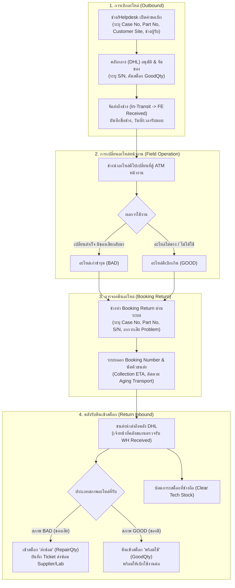

# 📋 แนวทางการเบิก-คืนอะไหล่ระบบใหม่ (Requisition & Return Workflow Guideline)
### ให้สอดคล้องกับรายงานประจำวัน (DHL / DATAONE Daily Report)

---

## 1. บทนำและวัตถุประสงค์ (Executive Summary)

เพื่อให้ระบบ **ATM Inventory System V2** สอดคล้องและสามารถทำงานร่วมกับกระบวนการจริงของคลังสินค้ากลาง (DHL) และฝ่ายปฏิบัติการภาคสนาม (DATAONE / Field Engineers) ได้อย่างราบรื่น เอกสารฉบับนี้กำหนด **"แนวทางการเบิก-คืนอะไหล่ใหม่"** โดยอ้างอิงจากโครงสร้างข้อมูลจริงในรายงาน **Daily Report**:
1. **Sheet `Outbound Order` & `24x7 ACTIVITY`** $\rightarrow$ กระบวนการเบิกอะไหล่ออกไปใช้งาน (Requisition)
2. **Sheet `Booking Return`** $\rightarrow$ กระบวนการแจ้งจองส่งคืนอะไหล่จากหน้างาน (Return Booking)
3. **Sheet `Return inbound`** $\rightarrow$ กระบวนการตรวจรับอะไหล่คืนเข้าคลัง (Return Inbound)
4. **Sheet `Minimum Stock`** $\rightarrow$ กระทบยอดสต็อกคลังกลาง (Good Stock vs Repair Stock)

---

## 2. แผนผังกระบวนการภาพรวม (End-to-End Workflow)



---

## 3. รายละเอียด 3 กระบวนการหลัก (Core Workflows)

### 3.1 กระบวนการที่ 1: การเบิกอะไหล่ (Outbound Requisition)
อ้างอิงโครงสร้าง Sheet **`Outbound Order `** และ **`24x7 ACTIVITY`**

#### ฟิลด์ข้อมูลที่ต้องบันทึกในระบบ:
| ฟิลด์ข้อมูล | ความหมาย / รูปแบบ | อ้างอิง Sheet |
| :--- | :--- | :--- |
| **Case No** | เลขที่เคสแจ้งซ่อม (เช่น `AS-20260824-00860`, `IB-20260822-40404`) | Column T |
| **Part Number / Desc** | รหัสอะไหล่และชื่ออะไหล่ | Column B, C |
| **Serial Number (S/N)** | S/N ของอะไหล่ที่หยิบจ่ายจริง | Column D |
| **Quantity** | จำนวนที่เบิก (ปกติอะไหล่ S/N = 1) | Column E |
| **FE Name** | ชื่อช่างภาคสนามผู้รับผิดชอบงาน | Column F |
| **Customer Site / Address** | จุดติดตั้งตู้ ATM (เช่น `ธ.ออมสิน สาขาสัมมากร เพลส ราชพฤกษ์`) | Column G, H |
| **Group / Region** | พื้นที่ปฏิบัติงาน (`BKK` / `UPC` ต่างจังหวัด) | Column J |
| **Order Type** | ประเภทการสั่งเบิก (`Normal` / `24x7 ACTIVITY` งานด่วน) | Column U |
| **Order Date & Time** | วันที่และเวลาที่สั่งเบิก | Column K, L |
| **ETA Date & Time** | กำหนดเวลาที่ของต้องถึงมือช่าง/หน้างาน | Column N, O |
| **FE Receive Date/Time** | วันและเวลาที่ช่างเซ็นรับของจริง (Proof of Handover) | Column Q, R |
| **Warehouse Ref / Booking** | รหัสงานคลัง / เลขโหลดขนส่ง (`SHIPPING LOAD_NUM`) | Column S, AC |

#### กฎการตัดสต็อก (Stock Deduction Rules):
- **สต็อกคลังกลาง (GoodQty):** ลดลงทันทีเมื่อคลังสแกนจ่ายออก (`Outbound Confirmed`)
- **สต็อกที่ช่างถือ (TechStock):** เพิ่มขึ้นเท่ากับจำนวนที่เบิก เมื่อช่างกดยืนยันรับของ (`FE Received`)
- **ความเคลื่อนไหว (Stock Movement):** บันทึก Type = `Outbound_Ticket` พร้อมผูก `Case No`

---

### 3.2 กระบวนการที่ 2: การจองคืนอะไหล่ (Booking Return)
อ้างอิงโครงสร้าง Sheet **`Booking Return`** (628 รายการใน Daily Report)

เมื่อช่างมีอะไหล่เสียจากการสลับเปลี่ยนหน้างาน หรือมีอะไหล่ดีที่เบิกไปแต่ไม่ได้ใช้งาน ช่างจะต้องทำรายการ **Booking Return** ล่วงหน้า เพื่อให้ขนส่ง/คลังเข้ารับพัสดุ

#### ข้อมูลที่ใช้ในกระบวนการ Booking Return:
1. **Booking Number:** เลขที่การจองรับคืน (เช่น `66410051045993`)
2. **Warehouse Reference:** รหัสเอกสารคลัง (เช่น `DATBKK20260824038`)
3. **Case No Booking:** อ้างอิง Case No เดิมที่เบิกไป (ทำให้ Traceability ครบวงจร)
4. **Service Type & Group:** ประเภทบริการ และเขตพื้นที่ (`BKK` ในเมือง / `UPC` ต่างจังหวัด)
5. **Collection Date & Time:** วันที่และเวลาที่นัดให้ขนส่งเข้าไปรับของจากช่าง/หน้างาน
6. **Return to WH ETA:** วันที่ของคาดว่าจะถึงคลังกลาง DHL
7. **Aging SLA Tracking:**
   - **Aging Transport:** นับระยะเวลาตั้งแต่ขนส่งรับของจนถึงคลัง
   - **Aging E2E (End-to-End):** นับระยะเวลาตั้งแต่วันที่ช่างเปิดจองคืน จนถึงวันที่คลังรับเข้าจริง (ต้องไม่เกิน SLA ที่กำหนด)

---

### 3.3 กระบวนการที่ 3: การตรวจรับคืนเข้าคลัง (Return Inbound)
อ้างอิงโครงสร้าง Sheet **`Return inbound`** (591 รายการใน Daily Report)

เมื่อพัสดุถูกส่งมาถึงคลังกลาง เจ้าหน้าที่คลัง (WH Receiver) จะทำการตรวจสภาพและสแกนรับเข้าระบบ

#### การจัดเกรดสภาพอะไหล่ (Condition Grading):
```
                       [ อะไหล่ส่งคืนถึงคลัง ]
                                 │
                 ┌───────────────┴───────────────┐
                 ▼                               ▼
       [ BAD : ชำรุด/ของเสีย ]           [ GOOD : ของดีไม่ได้ใช้ ]
                 │                               │
                 ▼                               ▼
     บันทึก Problem (อาการเสีย)             บันทึก Remark ตรวจสอบสภาพ
                 │                               │
                 ▼                               ▼
       เพิ่มเข้า RepairQty               เพิ่มเข้า GoodQty
    (คลังกลาง: สต็อกรอส่งซ่อม)           (คลังกลาง: สต็อกพร้อมใช้)
```

#### ฟิลด์ข้อมูลใน Return Inbound:
- **Part Number & Description:** รหัสและชื่ออะไหล่
- **Serial Number (S/N):** S/N ตัวที่ส่งคืน (ทั้งกรณีมี S/N หรือไม่มี S/N)
- **Inventory Status:** `BAD` (ของเสีย) หรือ `GOOD` (ของดี)
- **Problem (สำคัญมาก):** ระบุอาการเสียจริงตามรายงาน เช่น:
  - *"เฟื่องแตก"*, *"error code 11"*, *"sensor เสีย"*, *"ลูกยางหมดสภาพ"*, *"ไม่ดึงเงิน"*, *"ช็อตไหม้"*
- **WH Received Date / Time:** วันที่และเวลาที่คลังตรวจรับพัสดุจริง
- **System Received Date / Time:** วันที่และเวลาที่เจ้าหน้าที่บันทึกเข้าระบบ
- **TO_LOCATION:** ตำแหน่งจัดเก็บในคลัง (เช่น `DHL-BKK`, `Bin-R01`)
- **USER_STAMP:** ชื่อผู้ตรวจรับของคลัง

---

## 4. ผลกระทบต่อสต็อกรวม (Reconciliation Matrix)

| การกระทำ (Action) | Good Stock (คลังกลาง) | Repair Stock (คลังกลาง) | Tech Stock (ช่างถือ) | การเปลี่ยนแปลงในระบบ |
| :--- | :---: | :---: | :---: | :--- |
| **เบิกอะไหล่ออก (Outbound)** | 🔻 ลดลง | ➖ เท่าเดิม | 🔺 เพิ่มขึ้น | ตัดสต็อกดี $\rightarrow$ โอนไปที่ช่างตาม Case No |
| **รับคืนของเสีย (Return BAD)** | ➖ เท่าเดิม | 🔺 เพิ่มขึ้น | 🔻 ลดลง | ปลดภาระช่าง $\rightarrow$ เข้าสต็อกรอซ่อมพร้อมระบุ Problem |
| **รับคืนของดี (Return GOOD)** | 🔺 เพิ่มขึ้น | ➖ เท่าเดิม | 🔻 ลดลง | ปลดภาระช่าง $\rightarrow$ เติมกลับเข้าสต็อกพร้อมจ่ายทันที |
| **ส่งอะไหล่ไปซ่อมภายนอก (Send Vendor)**| ➖ เท่าเดิม | 🔻 ลดลง | ➖ เท่าเดิม | โอนจาก Repair Stock $\rightarrow$ In-Repair Vendor |
| **รับอะไหล่ซ่อมเสร็จกลับมา (Repair Return)**| 🔺 เพิ่มขึ้น | ➖ เท่าเดิม | ➖ เท่าเดิม | อะไหล่ซ่อมผ่าน QC $\rightarrow$ เพิ่มกลับเข้า Good Stock |

---

## 5. แผนการปรับปรุงฟังก์ชันในระบบ (System Action Items)

เพื่อให้หน้าบ้านและระบบรองรับตามแนวทางนี้ 100%:

1. **หน้าเบิกอะไหล่ (Requisition Screen / Ticket Form):**
   - เพิ่มช่องกรอก: `Case No`, `Customer Site / Bank Branch`, `FE Name`, `Order Type (Normal/24x7)`, `Required Date/Time`
   - เพิ่มการเลือกจ่ายอะไหล่แบบระบุ `Serial Number` จากรายการอะไหล่ดีที่มีอยู่ในคลังจริง

2. **หน้าจองคืนและรับคืนอะไหล่ (Return Module):**
   - **แท็บ 1: ช่างจองคืน (Booking Return):** ช่างเลือก Case No เดิม $\rightarrow$ เลือกอะไหล่ที่จะคืน $\rightarrow$ ระบุสภาพ (`BAD`/`GOOD`) $\rightarrow$ ระบุ `Problem` $\rightarrow$ ได้เลข `Booking Number`
   - **แท็บ 2: คลังตรวจรับ (Return Inbound):** คลังสแกน `Booking Number` หรือ `Serial Number` $\rightarrow$ ตรวจสภาพจริง $\rightarrow$ กดยืนยันรับเข้า (`WH Received`) $\rightarrow$ สต็อกปรับยอดอัตโนมัติ

3. **ระบบนำเข้า Daily Report ประจำวัน (Daily Report Auto-Sync):**
   - เมื่ออัปโหลดไฟล์ Excel ประจำวัน ระบบจะดึง:
     - Sheet `Outbound Order ` $\rightarrow$ บันทึกรายการเบิกและตัดยอดอัตโนมัติ
     - Sheet `Return inbound` $\rightarrow$ บันทึกรายการรับคืนและปรับสต็อก Good/Bad อัตโนมัติ
     - Sheet `Booking Return` $\rightarrow$ แสดง Dashboard ติดตามอะไหล่ค้างคืน (Aging SLA)
